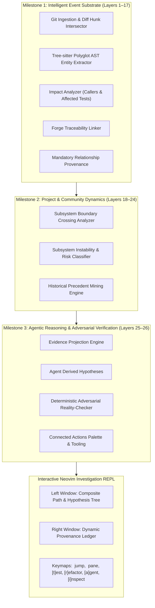

# Investigation Feature Walkthrough: Milestones 1, 2 & 3 Implementation

## Architectural Overview & Completed Foundation

The **Investigation (`investigate`)** subsystem in [`oculus.nvim`](../) has achieved full vertical integration across all 26 levels specified in [`rank.pdf`](../rank.pdf), [`static.pdf`](../static.pdf), and [`parse.pdf`](../parse.pdf):

---

## What Was Implemented in Milestone 3 (Layers 25–26)

### 1. Adversarial Reality-Checker ([`crates/oculus-engine`](../crates/oculus-engine/))
- **Data Models** ([`models.rs`](../crates/oculus-engine/src/models.rs)):
  - Added `AgentClaim`, `ClaimVerification`, `VerificationStatus` (`CONFIRMED`, `REFUTED`, `INCONCLUSIVE`), `ConnectedAction`, `AgentHypothesis`, and `DerivedInvestigation`.
  - Added `derived: Option<DerivedInvestigation>` to [`InvestigateFactBundle`](../crates/oculus-engine/src/models.rs).
- **Adversarial Engine** ([`adversarial.rs`](../crates/oculus-engine/src/adversarial.rs)):
  - Implemented `AdversarialRealityChecker::verify_claims`:
    - Evaluates agent claims against compiler AST facts, caller graphs, test coverage, and boundary dynamics.
    - Emits deterministic status, confidence score, witness citations, and refutation/confirmation proof.
  - Implemented `AdversarialRealityChecker::synthesize_derived_investigation`:
    - Generates grounded hypotheses (Caller Blast Radius, Architectural Boundary Leakage, Test Coverage & Regression Risk).
    - Assembles unanswered questions and candidate patch proposals.
    - Computes overall `adversarial_verdict` (`ALL_CLAIMS_VERIFIED`, `PARTIALLY_VERIFIED`, `CLAIMS_REFUTED`).
- **Investigator Integration** ([`investigate.rs`](../crates/oculus-engine/src/investigate.rs)):
  - Integrates derived investigation synthesis directly into the native investigation pipeline.

### 2. Investigation Agent & Action Generators ([`lua/oculus/investigate/agent.lua`](../lua/oculus/investigate/agent.lua))
- **Evidence Projection (`build_projection`)**:
  - Compresses 24 layers of deterministic ground truth into high-density prompts for LLMs (codex, agy, gemini).
- **Hypothesis Synthesis (`synthesize`)**:
  - Orchestrates hypothesis generation and runs claims through adversarial reality-checking, with offline/deterministic fallback.
- **Invariant Test Scaffold Generator (`generate_test_scaffold`)**:
  - Synthesizes ready-to-run test templates in Lua (`describe/it`), Rust (`#[test]`), or C exercising modified entities and protecting callers.
- **Decoupling Refactor Planner (`generate_refactor_plan`)**:
  - Produces architectural decoupling proposals (dependency inversion, event buses, facade adapters) for boundary crossings.

### 3. Neovim Multi-Pane UI & Connected Actions ([`lua/oculus/investigate/window.lua`](../lua/oculus/investigate/window.lua))
- **Left Composite Path Tree**:
  - `▾ AGENT HYPOTHESES & ADVERSARIAL VERIFICATIONS (Layers 25-26) [VERDICT]`
  - Highlights confirmed claims (`[CONFIRMED]`) in `DiagnosticOk` and refuted claims (`[REFUTED]`) in `DiagnosticError`.
  - `▾ CONNECTED ACTIONS & EXPERIMENTS` palette.
- **Right Provenance Ledger**:
  - Dedicated inspectors for `agent_hypothesis`, `claim_verification`, and `connected_action`.
- **Interactive Action Keymaps**:
  - `[t]`: Opens floating preview with generated invariant test scaffold.
  - `[r]`: Opens floating preview with subsystem decoupling refactor plan.
  - `[a]`: Triggers agent hypothesis synthesis and ground-truth re-verification.
  - `[i]`: Seamlessly pivots into Oculus Inspect diff review.
  - `<Tab>`: Toggles focus between Tree and Ledger.
  - `<CR>`: Jumps directly to symbol source code.
  - `q` / `<Esc>`: Closes investigation.

---

## Verification & Validation

1. **Rust Test Suite**: 9/9 tests passing (`cargo test --manifest-path crates/oculus-engine/Cargo.toml`):
   - Added `test_adversarial_reality_checker` verifying that false claims (e.g. claiming a symbol has no callers when callers exist) are deterministically refuted with caller citations, and true claims are confirmed.
2. **Lua Test Suite**: 11/11 tests passing (`nvim --headless -u NONE -l tests/investigate_spec.lua`):
   - Verified agent fact projection.
   - Verified test scaffolding and refactor plan generation.
   - Verified derived investigation rendering and adversarial claim ledger inspection.
3. **Release Binary**: `crates/oculus-engine/target/release/oculus-engine.exe` compiled and verified.
4. **Code Quality & Git Rules**:
   - `:LuaParagraphFormat` run on all edited Lua buffers.
   - Committed (`be7e756`) and pushed to `origin/main`.
   - `nvim --headless "+Lazy! update" +qa` executed to synchronize the local plugin installation.
